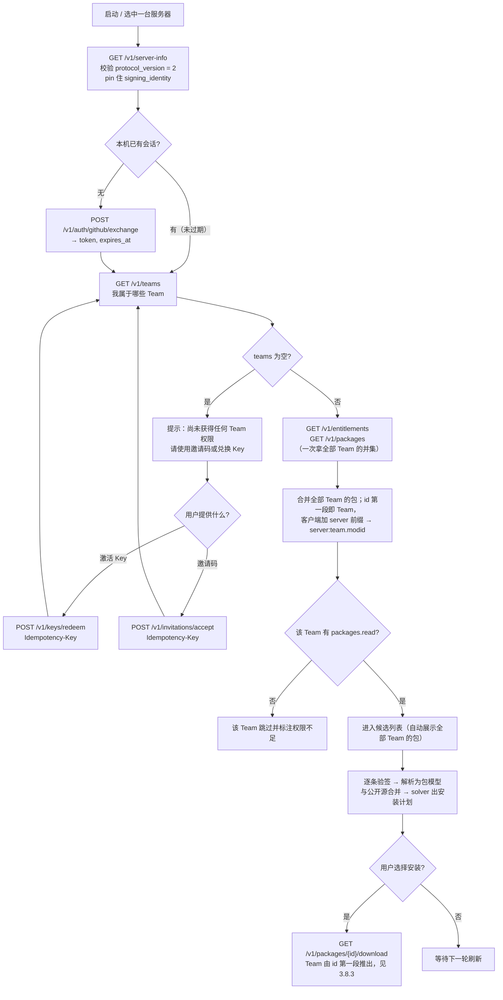
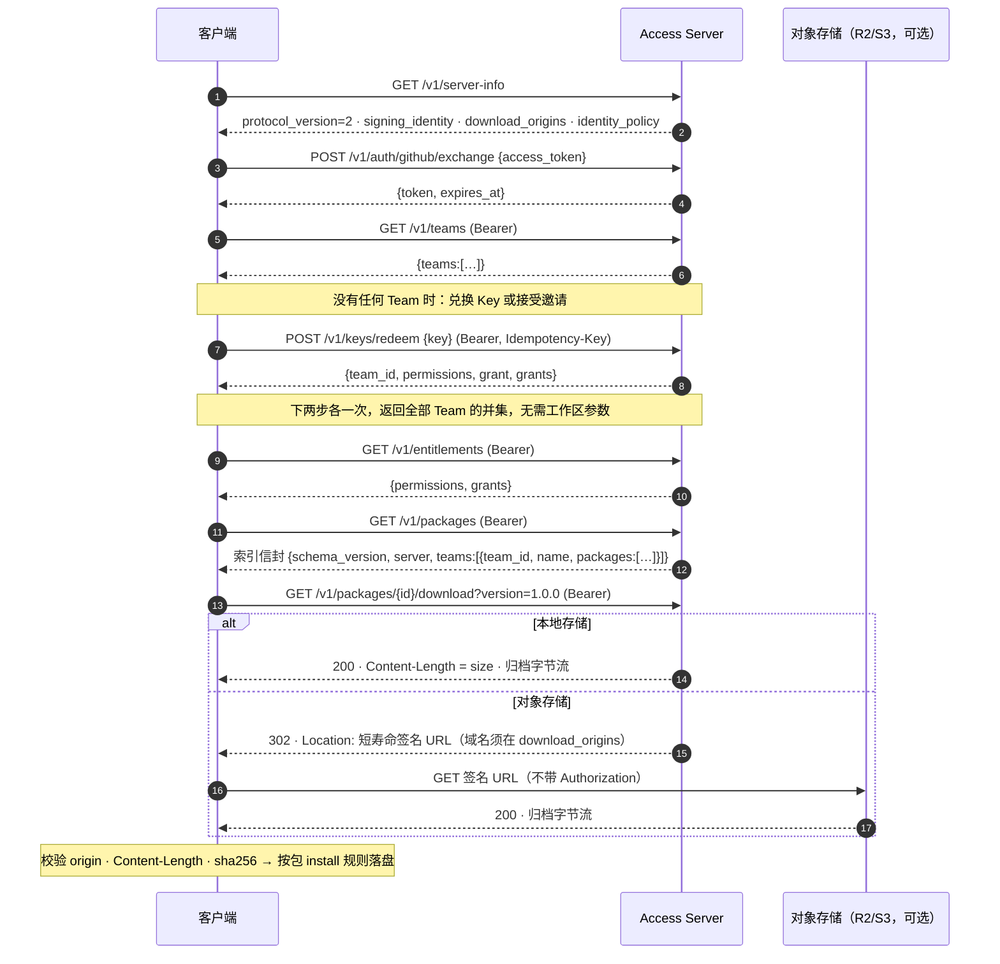
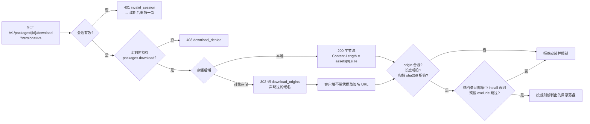

# 私有分发接口清单与调用链（`/v1`，协议版本 2）

本文件是给客户端（SprocketModManager）用的对外契约：**每个接口做什么、调用链怎么走、两边各发什么**。
目标契约即本文件；服务端实现的当前形状见 `runtime-communication-contract.md`，实现完成后以本文件为准。

- 协议版本：`protocol_version = 2`（客户端 `SUPPORTED_PROTOCOL_VERSION` 必须同步为 2，否则 `server-info` 直接拒绝）。
- 路径前缀：`/v1/`，与客户端配置的服务器地址同源。
- 鉴权：`Authorization: Bearer <session>`，除 `server-info` 与 `auth/github/exchange` 外全部必需。
- **无工作区参数**：客户端不传 Team / 工作区。会话决定"你是谁"，包 id 的第一段就是所属 Team（`<team_id>.<mod>`），所以服务端能自行推出每件事的作用域；`download` 也由 id 推出 Team。权限字符串本身带 Team 段（`team.<team_id>.…`），客户端据此归属。
- 幂等：`keys/redeem`、`invitations/accept` 必须带 `Idempotency-Key`，重复键返回同一结果。
- 请求共性：JSON 请求体 `Content-Type: application/json`；可带 `User-Agent`（含客户端版本）供审计，不参与放行判定；所有请求可带 `Accept: application/json`，下载接口除外。
- 体积上限：JSON 响应 < 2 MiB；归档 < 1 GiB。
- 路径中的 `{id}` 为包 id，版本通过查询参数给出。

## 1. 一览

| # | 方法与路径 | 作用 | 鉴权 | 幂等键 |
| --- | --- | --- | --- | --- |
| 1 | `GET /v1/server-info` | 信任引导：声明协议版本、服务器身份、签名公钥、允许的下载源与轮换声明 | 无 | — |
| 2 | `GET /v1/teams` | 团队发现：列出我在这台服务器上当前有效的 Team | 会话 | — |
| 3 | `POST /v1/auth/github/exchange` | 用 GitHub 访问令牌换本服务器会话（含到期时间） | 无 | — |
| 4 | `POST /v1/auth/session/revoke` | 注销当前会话 | 会话 | — |
| 5 | `POST /v1/keys/redeem` | 兑换激活 Key，取得某个 Team 的权限分配 | 会话 | 必需 |
| 6 | `POST /v1/invitations/accept` | 用邀请码加入 Team | 会话 | 必需 |
| 7 | `GET /v1/entitlements` | 查我全部 Team 的权限与授权记录（并集，逐条带 `team_id`） | 会话 | — |
| 8 | `GET /v1/packages` | 取我有权访问的**全部 Team** 的私有 mod 索引（包按 Team 分组，含签名） | 会话 | — |
| 9 | `GET /v1/key-status` | 取本人 Key 状态的签名快照 | 会话 | — |
| 10 | `GET /v1/packages/{id}/download` | 下载包归档：本地存储直接流式返回，对象存储则 302 到短寿命签名 URL（Team 由 id 第一段推出） | 会话 | — |
| 11 | `GET /healthz` | 探活与协议版本检查（运维用，非客户端流程） | 无 | — |

## 2. 逐个接口

### 1. `GET /v1/server-info` — 信任引导
作用：客户端第一次接触服务器时确认"这是谁、支持哪个协议版本、用哪把公钥签名、允许把下载指向哪里"。客户端会记住公钥，之后该服务器的所有条目签名都要求用它验签。
返回：`protocol_version`、`server_id`、`name`、可选 `operator`、`download_origins`（允许把下载指向哪些源：裸主机名表示仅接受 `https` 并按主机名匹配；完整 origin 则按 scheme/host/port 精确匹配）、`signing_identity`（`key_id`/`algorithm`/`encoding`/`public_key`）、可选 `signing_rotation`（`declaration`/`previous_signature`/`next_signature`）、`identity_policy`（可协商的信任方式与编码）。
约束：声明了 `signing_identity` 就必须对**每个条目**签名，并对 `/v1/key-status` 签名。

### 2. `GET /v1/teams` — 团队发现
作用：告诉客户端"你的账号在这台服务器上属于哪些 Team"（Team 名称展示 + "一个 Team 都没有"的空状态判定）。客户端**自动展示全部可用 Team 的内容**：索引与权限都是**一次请求返回全部 Team 的并集**，不需要逐个 Team 取、也不需要传 Team 参数。
返回：`{teams: [{team_id, name, status, permissions}]}`（`team.<id>.*` 任一节点有效即可见）。

### 3. `POST /v1/auth/github/exchange` — 换会话
作用：用本机保存的 GitHub 访问令牌换取本服务器会话，后续所有请求用它鉴权。
请求：`{access_token}`。返回：`{token, expires_at}`。
约束：GitHub 令牌有效期内允许重复兑换（用于静默续期），旧会话不立即吊销。

### 4. `POST /v1/auth/session/revoke` — 注销
作用：登出时让服务器立刻失效当前会话。
请求：`{}`。返回：`{revoked: true}`。

### 5. `POST /v1/keys/redeem` — 兑换激活 Key
作用：把一串激活 Key 变成"某 Team 里的权限分配"。Key 自带它属于哪个 Team。
请求：`{key}`。返回：`{github_user_id, team_id, permissions, grant, grants}`。
说明：`team_id` 只是提示，权威来源是接口 2；`grant`/`grants` 字段为 `id`/`active`/`status`/`expires_at`/`permissions`，`status` 取 `active`/`expired`/`suspended`/`revoked`。

### 6. `POST /v1/invitations/accept` — 接受邀请
作用：被邀请人用邀请码加入 Team（管理端网页也能接受，本接口让客户端具备同样能力）。
请求：`{token}`。返回：`{team_id, permission_template_name, status}`。
约束：令牌即凭据；会话只用于确认身份，非受邀账号必须拒绝。

### 7. `GET /v1/entitlements` — 查权限
作用：取"我**在全部 Team 里**此刻有什么权限"。每轮都要重新取，缓存索引不等于缓存授权。
返回：`{permissions, grants}`；每条 grant 带 `team_id`，权限字符串自带 Team 段（`team.<team_id>.…`）。
服务端不需要工作区参数：会话决定身份，作用域由数据自身表达。

### 8. `GET /v1/packages` — 取包列表（索引）
作用：客户端拉取 mod 列表的唯一入口，一次返回我有权访问的**全部 Team** 的包。
返回：`{schema_version, generated_at, server, teams}`；`teams` 是 `[{team_id, name, packages}]`，每个 Team 的包就挂在它自己下面。保留 workspace（`system`、`template`）不出现；其余 Team 一律带 `packages` 键（没有已发布包时是空数组）。条目 `id` 的第一段就是所属 Team。

**条目就是公开注册表的 v3 条目**（`schema_version: 3`）：字段形状、必填项与约束都照 `sprocket-mod.schema.json`。服务端只产出包与版本带来的东西 —— `id` 是 `<team_id>.<mod>`，`schema_version` 恒为 3，`releases` 来自已发布版本；公开目录自己的抓取与推荐语义（`release`、`featured`）在私有侧不出现，`signature` 是唯一的私有加法。权威 schema 只有一份：`schemas/sprocket-private-index.schema.json`（信封），条目部分 `$ref` 到 `schemas/sprocket-mod.schema.json`（公开 v3 的逐字镜像）。

**不是每个字段都出现**：`authors` 与 `repository` 按内容决定 —— 没有作者、或仓库不是 `<owner>/<name>` 时这两个键直接省略（v3 的 `authors` 一旦出现就至少一项，`repository` 只收字符串）。

**id 规则**：条目 `id` 的第一段是**所属 Team id**，形如 `<team_id>.<mod>`（两段，例如 `sprocket-build-team.meta`）。它满足公开 id 模式（`.` 与 `-` 都算分隔符），**不允许冒号** —— `server:team.modid` 这种带冒号的形式只存在于客户端本地命名空间（客户端用现成的 `server_id:` 前缀拼出）。id 自带归属，因此跨 Team 不可能重名。

**多版本**：一个包一个条目，`releases` 为 **1..N** 条，每个已发布版本一条。每条 release 用公开形状：`id`/`tag`/`version`/`prerelease`/`published_at`/`assets`/`dependencies`/`compatibility`；`assets` 每版本一个载荷（归档或单个 DLL），字段为 `id`/`name`/`size`/`download_url`/`digest`/`updated_at`，其中 `download_url` 是**绝对 URL**（服务端自己的下载端点，客户端自行追加 `?version=<v>`）。release 级 `dependencies` 取公开的 release 形状 `{id, version}`（包级 `dependencies` 的三个键 `{id, version, when}` 中的 `when` 不外泄），与 `compatibility{source:"declared"}` 一样来自**包级声明**，因此同包各版本一致。落点不在条目里：安装规则属于包，客户端按 `install` 解析。下架版本不进索引，只留在管理端历史。

约束：整体小于 2 MiB。

### 9. `GET /v1/key-status` — Key 状态快照
作用：自助查看自己的 Key 是否已兑换、是否过期或被撤销；返回带服务器签名的快照，客户端验签并检查有效期上限。
返回：签名快照（`status` + 签发时间 + 有效期 + `signature`）。

### 10. `GET /v1/packages/{id}/download` — 下载发布载荷
作用：拿到该版本的发布载荷。载荷是归档（`.zip`）或单个 DLL（`.dll`），由发布时记录的载荷类型决定，`assets[0].name` 的扩展名即为实际类型。服务器在这里做最终的合法性判定，并按存储后端决定传输方式。
请求：`?version=<v>`，带会话头与 `Accept: application/octet-stream`。
传输方式：
- **本地存储**：直接流式返回字节。
- **对象存储（R2/S3 等）**：`302` 到短寿命签名 URL；目标域名必须在 `server-info.download_origins` 中声明，客户端只接受"服务器 origin 或已声明域名"。
服务端校验：会话有效 ∧ **此刻**仍持有该 Team 的 `packages.download`；`Content-Length` 精确等于条目里的 `assets[0].size`；不得把下载指向未声明域名。
客户端另会自行比对字节摘要（不符即拒）。

### 11. `GET /healthz` — 探活
作用：运维探活与协议版本检查，不属于客户端业务流程。

## 3. 调用链与报文

> 图见 3.8（总览流程图 / 时序图 / 下载校验门）；下面是逐场景的字段级报文。

### 3.1 首次连接（本机没有凭据）

```text
① 客户端 → GET /v1/server-info
   服务器 → 200 {protocol_version:2, server_id, name, operator, download_origins, signing_identity,
                 signing_rotation:null, identity_policy}
```

② 客户端 `POST /v1/auth/github/exchange`
```json
请求  { "access_token": "<GitHub 令牌>" }
响应  { "token": "<session>", "expires_at": 1791515130 }
```
客户端保存 `session` 与 `expires_at`，并记住本次连接的服务器 `server_id`。

③ 客户端 `GET /v1/teams`（`Authorization: Bearer <session>`）
```json
响应  { "teams": [] }
```
`teams` 为空是**合法且必须区分**的状态：客户端提示"这台服务器还没有给你任何 Team 权限，请使用邀请码或兑换 Key"，而不是显示空包列表。

④ 用户输入激活 Key → 走 3.3；用户输入邀请码 → 走 3.4。

### 3.2 常规一轮（自动展示全部可用 Team）

```text
① GET /v1/teams                       → 取回全部可用 Team（名称展示 + 空状态判定）
② GET /v1/entitlements                → 全部 Team 的权限并集（每条 grant 带 team_id）
③ GET /v1/packages                    → 一次返回我有权的全部 Team 的包（按 Team 分组）
④ 合并展示；solver 出计划时跨 Team 可见
⑤ 用户选择安装                        → 走 3.5（无需传 Team，服务端从 id 第一段推出）
```

多 Team 带来的硬性要求：
1. **命名空间**：条目 `id` 的第一段就是所属 Team（`<team_id>.<mod>`），客户端沿用现成的 `server_id:` 前缀即可得到 `server:team.modid`；同源 `dependencies`/`recommendations` 也由客户端统一加前缀。
2. **依赖限同 Team**：依赖必须是同 Team 内的 `<team_id>.<mod>`，因为索引里跨 Team 的 id 前缀不同源，客户端的同源改写不会命中。
3. **无 Team 归属记忆**：不再需要记住"这个包属于哪个 Team"——`download` 由 id 第一段推出 Team，权限字符串自带 Team 段。客户端只需展示时按 id 前缀分组。

② 中 `GET /v1/packages` 的响应：
```json
{ "schema_version": 1,
  "generated_at": "2026-10-02T11:30:00Z",
  "server": {"server_id": "…", "name": "…", "operator": ""},
  "teams": [
    { "team_id": "sprocket-build-team", "name": "Sprocket Build Team",
      "packages": [
        { "schema_version": 3, "id": "sprocket-build-team.example", "name": "example",
          "authors": ["alice"], "repository": "alice/sprocket-example", "license": "MIT",
          "display_name": {"en": "Example"}, "description": {"en": "…"},
          "dependencies": [ {"id": "lavagang.melonloader", "version": ">=0.7.3", "when": "always"} ],
          "recommendations": [], "tags": [], "category": "gameplay",
          "install": { "files": [ {"match": "*.dll", "type": "melonloader:mod"} ],
                       "scan_dlls": true, "exclude": [] },
          "releases": [
            { "id": 2, "tag": "1.1.0", "version": "1.1.0", "prerelease": false,
              "published_at": "2026-10-02T11:28:00Z",
              "assets": [ { "id": 1, "name": "sprocket-build-team.example.zip",
                            "size": 401, "digest": "sha256:…",
                            "updated_at": "2026-10-02T11:28:00Z",
                            "download_url": "https://server.example/v1/packages/sprocket-build-team.example/download" } ],
              "dependencies": [ {"id": "lavagang.melonloader", "version": ">=0.7.3"} ],
              "compatibility": {"source": "declared"} },
            { "id": 1, "tag": "1.0.0", "version": "1.0.0", "prerelease": false,
              "published_at": "2026-09-20T08:00:00Z",
              "assets": [ { "id": 1, "name": "sprocket-build-team.example.zip",
                            "size": 349, "digest": "sha256:…",
                            "updated_at": "2026-09-20T08:00:00Z",
                            "download_url": "https://server.example/v1/packages/sprocket-build-team.example/download" } ],
              "dependencies": [ {"id": "lavagang.melonloader", "version": ">=0.7.3"} ],
              "compatibility": {"source": "declared"} } ],
          "signature": {"format": "detached-canonical-json", "algorithm": "ed25519", "encoding": "base64url",
                        "key_id": "local-dev-key", "signature": "…"} }
      ] },
    { "team_id": "quiet-team", "name": "Quiet Team", "packages": [] }
  ] }
```
客户端逐条目：用 pin 住的公钥验 `signature` → 解析成内部包模型（私有 reader 适配）→ 与公开注册表条目合并 → solver 按版本选 release 出安装计划。下载时用该 release 的 `version` 调 `download`，服务端返回对应版本的归档。

### 3.3 兑换 Key

```text
客户端 → POST /v1/keys/redeem
         Authorization: Bearer <session>
         Idempotency-Key: <uuid>
请求  { "key": "SMAS6N54M5YKKEFRPBSK09GZ" }
响应  { "github_user_id": "1000000005",
        "team_id": "sprocket-build-team",
        "permissions": ["team.sprocket-build-team.packages.download", "…"],
        "grant":  {"id": "…", "active": true, "status": "active", "expires_at": null, "permissions": ["…"]},
        "grants": [ … ] }
```
客户端把 `team_id` 记入这台服务器的 Team 列表（可多个），然后走 3.2。
失败：`409 key_unavailable`（已用/过期/撤销）、`403 team_access_denied`（Team 不可用）。

### 3.4 接受邀请

```text
客户端 → POST /v1/invitations/accept
         Authorization: Bearer <session>
         Idempotency-Key: <uuid>
请求  { "token": "<邀请码>" }
响应  { "team_id": "sprocket-build-team", "permission_template_name": "Tester", "status": "accepted" }
```
客户端随后重新 `GET /v1/teams` 并把新 Team 记入列表，然后走 3.2。
失败：`400 invitation_invalid`（无效/过期/非本人）。

### 3.5 下载并安装

前置：条目里 `assets[0] = {id, name, size, digest, updated_at, download_url}`（绝对 URL，客户端自行追加 `?version=<v>`）。

```text
① 客户端 → GET /v1/packages/{id}/download?version=1.0.0
            Authorization: Bearer <session>
            Accept: application/octet-stream
```
② 服务器按存储分支：
```text
本地存储   → 200
             Content-Type: application/octet-stream
             Content-Length: <assets[0].size>
             <归档字节流>

对象存储   → 302
             Location: https://<download_origins 中的域名>/<key>?X-Amz-…
```
对象存储分支下，客户端**不带凭据**重新请求该 URL（不得把 `Authorization` 带到存储域名）。

③ 客户端校验（两种分支一致）：
- 最终 origin ∈ {服务器 origin} ∪ `server-info.download_origins`；
- `Content-Length` 等于 `assets[0].size`；
- 累计写入字节数等于 `size`；
- 归档 sha256 等于 `assets[0].digest`。

④ 解包安装：按包条目里的 `install` 规则决定每个条目的去向——`files[]` 用 `type`（`<加载器>:<类别>`）在客户端已装的加载器注册表里查出目标目录，`payload[]` 直接用 `target`（`{Sprocket}/…`）；被 `exclude` 命中的条目跳过。

失败：`403 download_denied`（无权限或授权已失效）、`404 package_not_found`。

### 3.6 会话过期与续期

```text
① 任意请求返回 401 invalid_session
② 客户端 → POST /v1/auth/github/exchange {access_token}   （本机 GitHub 令牌仍有效时）
   服务器 → {token, expires_at}；客户端重放步骤 ① 的请求一次
③ GitHub 令牌也失效 → 客户端重走 GitHub 设备流，重新取得 GitHub 令牌后回到 ②
```
客户端应在 `expires_at` 之前主动续期，避免撞上 401。

### 3.7 错误路径走向

| 触发 | 服务端返回 | 客户端动作 | 用户可见结果 |
| --- | --- | --- | --- |
| 会话失效 | `401 invalid_session` | 重新 exchange 并重放一次 | 无感；失败则要求重新登录 |
| GitHub 令牌被拒 | `401 github_token_rejected`（由 GitHub 判定） | 重新走设备流 | 提示需要重新登录 GitHub |
| GitHub 限流/权限不足 | `403 github_token_forbidden` | 提示并稍后重试 | 登录态保留 |
| 无该 Team 权限 | `403 permission_denied` | 停止当前操作 | 提示权限不足 |
| Team 不可用 | `403 team_access_denied` | 回到 ① 重新选 Team | 提示 Team 不可用 |
| 包下载被拒 | `403 download_denied` | 停止下载 | 提示权限不足 |
| Team 不存在 | `404 team_not_found` | 从列表移除该 Team 并刷新 | 提示该 Team 不可用 |
| 包不存在/不可下载 | `404 package_not_found` | 刷新 ③ | 刷新列表 |
| Key 不可用 | `409 key_unavailable` | — | 提示 Key 不可用 |
| 邀请无效 | `400 invitation_invalid` | — | 提示邀请无效 |
| 数据无效 | `400 invalid_request` | — | 提示 |

### 3.8 流程图

#### 3.8.1 总览：连接 → 取列表 → 安装（Mermaid）



#### 3.8.2 调用时序（Mermaid）



#### 3.8.3 下载与安装的校验门（Mermaid）



#### 3.8.4 总览的纯文本版（不依赖渲染）

```text
启动
 └─► GET /v1/server-info ── 校验 protocol_version=2、pin 公钥、记下 download_origins
      │
      ├─ 无会话 ──► POST /v1/auth/github/exchange ──► token / expires_at
      ▼
   GET /v1/teams
      ├─ 空 ──► 提示「尚未获得任何 Team 权限」
      │          ├─ 激活 Key ──► POST /v1/keys/redeem
      │          └─ 邀请码   ──► POST /v1/invitations/accept
      │                              （成功后回到 GET /v1/teams）
      └─ 非空 ─► GET /v1/entitlements + GET /v1/packages（各一次，拿全部 Team 的并集）
                   │  逐条验签 → 解析 → 与公开源合并 → solver 出计划
                   ▼
             自动展示全部 Team 的包（按 id 前缀分组）
                   │
                   ▼
             用户点安装
                   │
                   ▼
             GET /v1/packages/{id}/download?version=   （Team 由 id 第一段推出）
                   ├─ 本地存储 ──► 200 字节流
                   └─ 对象存储 ──► 302 签名 URL ──►（不带凭据）取回
                                     │
                                     ▼
                        校验：origin / Content-Length / 归档 sha256
                                     │ 全部通过
                                     ▼
                              按包的 install 规则解析出的目录落盘
```

## 4. 错误码

| code | HTTP | 含义 | 客户端应对 |
| --- | --- | --- | --- |
| `invalid_session` | 401 | 会话失效 | 重新执行接口 3 |
| `github_token_rejected` | 401 | GitHub 判定令牌无效 | 需要重新登录 GitHub |
| `github_token_forbidden` | 403 | GitHub 因权限/限流拒绝 | 提示并稍后重试，**不**销毁登录 |
| `permission_denied` | 403 | 无权限 | 提示 |
| `team_access_denied` | 403 | Team 不可用 | 回到接口 2 重新选择 |
| `download_denied` | 403 | 下载授权不成立 | 提示权限不足 |
| `team_not_found` | 404 | Team 不存在 | 回到接口 2 |
| `package_not_found` | 404 | 包不存在或不可下载 | 刷新接口 8 |
| `key_unavailable` | 409 | Key 已用/过期/撤销 | 提示 Key 不可用 |
| `invitation_invalid` | 400 | 邀请无效/过期/非本人 | 提示邀请无效 |
| `team_application_exists` | 409 | 同名待审申请已存在 | 提示 |
| `confirmation_required` | 409 | 需要确认令牌 | 走确认流程 |
| `invalid_request` | 400 | 数据无效 | 提示 |

## 5. 与其他接口面的边界

- 本文件只覆盖**桌面客户端**用的 `/v1` HTTP 接口。
- 管理端网页走 WebSocket 资源调度（同一套授权模型、同一份数据），其动作与节点清单见 `runtime-communication-contract.md` 与 `authorization-design.md`。
- 两者共享授权判定：Team 权限节点 `team.<team_id>.*`、平台权限 `system.*`，以及 Key/邀请/模板产生的授权记录。
